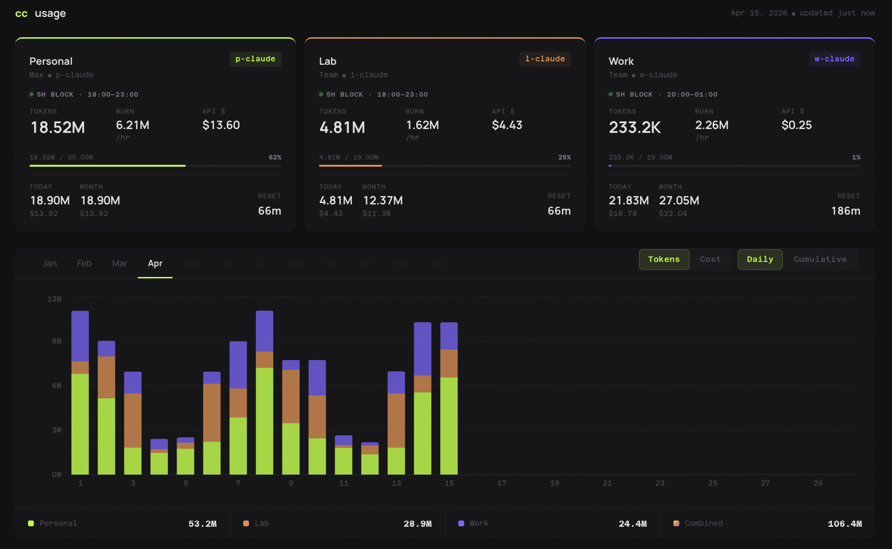

# multi-cc-usage



Multi-account Claude Code usage dashboard. Aggregates `ccusage` output across
several `CLAUDE_CONFIG_DIR`s (e.g. personal / lab / work) and serves a small
React dashboard at `http://localhost:5173`.

## Requirements

- Python 3.10+
- Node 18+
- [`ccusage`](https://github.com/ryoppippi/ccusage) CLI on `$PATH`
- Per-account Claude Code config dirs (e.g. `~/.claude-personal`, `~/.claude-lab`, `~/.claude-work`)

## Setup

1. Copy the account template and edit it:

   ```sh
   cp accounts.example.json accounts.json
   # edit accounts.json — set id/name/email/plan/alias/config_dir/token_limit_5h
   ```

   `accounts.json` is gitignored. Alternatively, set `CC_ACCOUNTS_JSON` to a
   JSON array string to override the file.

2. Install web deps:

   ```sh
   cd web && npm install
   ```

## Run

Two processes:

```sh
# terminal 1 — backend API on :8765
python3 app.py

# terminal 2 — vite dev server on :5173 (proxies /api to :8765)
cd web && npm run dev
```

Then open http://localhost:5173.

### Tip: one-shot `cc-dash` command

Drop a function into `~/.zshrc` (or `~/.bashrc`) so a single `cc-dash` starts
both processes and opens the browser:

```sh
cc-dash() {
  local root="$HOME/path/to/multi-cc-usage"   # ← edit this
  ( cd "$root"     && python3 app.py ) &
  ( cd "$root/web" && npm run dev   ) &
  sleep 1 && open http://localhost:5173
  wait
}
```

Now `cc-dash` in any terminal brings the dashboard up; `Ctrl-C` tears both
servers down together.

## Account config shape

Each entry in `accounts.json`:

| field            | example                  | notes                                              |
|------------------|--------------------------|----------------------------------------------------|
| `id`             | `"personal"`             | stable key used in charts                          |
| `name`           | `"Personal"`             | display name                                       |
| `email`          | `"you@example.com"`      | display only                                        |
| `plan`           | `"Max"` / `"Team"` / …   | display only                                        |
| `alias`          | `"p-claude"`             | shell alias, display only                           |
| `config_dir`     | `"~/.claude-personal"`   | `CLAUDE_CONFIG_DIR` passed to `ccusage`             |
| `token_limit_5h` | `30000000`               | estimated 5h-window budget for % gauge              |

## Credits

This project is a thin visualization layer on top of
[**ccusage**](https://github.com/ryoppippi/ccusage) by
[@ryoppippi](https://github.com/ryoppippi) — all usage numbers come from
shelling out to the `ccusage` CLI. ccusage is distributed under the MIT
license; huge thanks to the author.

## License

MIT
